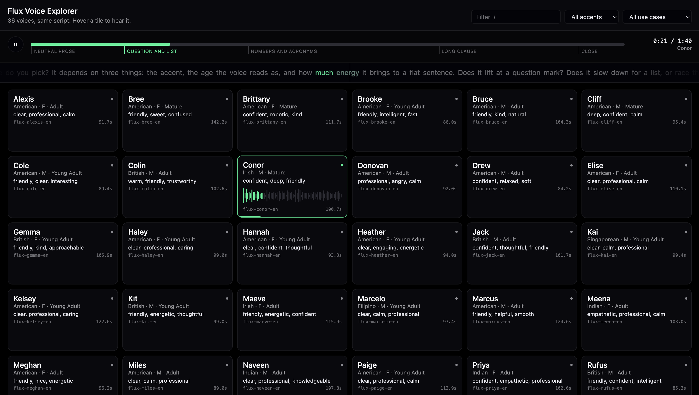

# Flux Voice Explorer

**Live: <https://dg-devrel-flux-voice-explorer.fly.dev>**

Every Deepgram Flux TTS voice reading the same script, on one shared playhead.
Hover a tile and you hear that voice at the current position. Move to the next
tile and the voice changes under a playhead that never stopped.

The point is that the script is identical across every tile, so the only
variable is the voice. That also makes pace measurable: same words, so a shorter
clip is literally a faster talker, and the grid can sort by it.

All 36 voices here are the GA catalog, generally available on the hosted API
since 2026-08-12 and documented at
[Flux TTS Voices & Languages](https://developers.deepgram.com/docs/flux-tts/voices).



Reading that screenshot: the transport bar marks the five script sections, the
ticker tape below it scrolls the script with the spoken word in green, and the
focused tile (Conor) is the only one showing a waveform. The `100.7s` on each
tile is how long that voice takes to read the identical script -- Bree needs
142.2s, Drew 84.2s.

## Quick start

```bash
make init      # creates .env from sample.env
# paste your key from https://console.deepgram.com into .env
make install
make clips     # renders one clip per voice. ~1 API call each, a few minutes
make start     # http://localhost:8080
```

`make dev` instead of `make start` for the Vite dev server on 8080 with the API
on 8081.

## How it works

```
scripts/generate-clips.ts     GET /v2/models  -> what voices exist right now
                              POST /v2/speak  -> one clip per voice
                              writes public/clips/*.mp3 + manifest.json

scripts/align-clips.ts        POST /v1/listen -> real word timings per voice
                              writes public/clips/timings.json

scripts/peaks.ts              ffmpeg, no API -> waveform envelope per voice
                              writes public/clips/peaks.json

src/lib/sync-player.ts        the shared playhead
src/App.tsx                   grid, filters
src/server/index.ts           serves dist/ and public/clips/. No secrets.
```

`public/clips/manifest.json` is the entire contract between the generator and
the UI. There is no build step joining them, so that JSON *is* the API.

### The playhead is a position in the script, not a fraction of a clip

The clips are not the same length and, more importantly, they do not pace the
script the same way. So `progress` is a position on the **canonical timeline**
(the mean of all 36 measured word timelines), and every tile converts it through
its own word positions. Hover a new tile mid-sentence and you land on the same
**word**.

The cheaper version -- seek the new voice to `progress * itsDuration` -- is what
this did first, and it is wrong in a way you can hear. It assumes two voices
spend their time through the script identically, only faster or slower. They do
not: each places its own pauses. Handing off from Drew (84s) to Bree (142s)
under the old rule:

| Drew is on | you would land on | off by |
|---|---|---|
| than | flattered | 8 words |
| voice | flat | 11 words |
| it? | a | 9 words |

Worst case across all 1,260 voice pairs was **17 words**. With the per-voice
mapping the error is zero by construction: same word in, same word out.

While a voice is audible it owns the clock, read back through its own timeline,
so the transport bar and ticker cannot drift from what you are hearing. The
seconds readout is the element's own `currentTime`, deliberately not
`progress * duration`, which is only correct for a voice that paces like the
average.

Only the focused element plays. Keeping all of them playing and muted was the
first design and it buys nothing — a muted element advances at rate 1 while the
normalized playhead advances at 1/reference, so by two minutes in it needs the
same seek on focus that a paused element needs. Same seek, 36x the decoders.

### Why clips are pre-rendered

Hovering is free. If each hover hit the API, an idle mouse would cost money and
every tile would have a first-hover delay. It also means the deployed app talks
to nothing: no API key, no rate limits, no cold-start latency.

## Keys

| Key | |
|---|---|
| `space` | play / pause |
| `←` `→` | ±5s of the audible voice |
| `shift` `←` `→` | ±30s |
| `/` | focus the filter |

Drag the ticker tape to scrub; tap a word to jump to it. The audio ducks for the
length of the drag, because re-seeking a playing element once per pointer move is
a stutter rather than a scrub.

Pressing play focuses the first voice on screen, so it always makes a sound
rather than scrolling the script in silence. On a desktop, moving the mouse off
the grid pauses; moving back onto a tile resumes. That is mouse-only on purpose:
on touch, `pointerleave` fires when the finger lifts, so it would pause on every
tap.

Hover is the fun path but not an accessible one, so every tile is a real button:
tabbing to it plays it the same way.

### Word timings are measured, not estimated

The ticker highlights the word being spoken, which means it needs to know when
each word is spoken. Batch `/v2/speak` returns audio and nothing else.

So `pnpm align` sends each rendered clip back through STT and aligns the
transcript to the script with Needleman-Wunsch, then stores the real position of
every script word for every voice. Alignment rather than a straight zip because
the token streams do not match: STT spells "429" as "four twenty nine", hears
"/v2/speak" as loose words, and occasionally drops one. On this script 96-98% of
words match outright and the rest are interpolated between their matched
neighbours.

The syllable estimate in `src/lib/word-timeline.ts` is only a fallback for
before `pnpm align` has run, and it is not good. Measured against the real
timings across all 36 voices it is out by up to 8.9 seconds, 21 words. On
`flux-sharon-en`:

| real time | actual word | syllable estimate | drift |
|---|---|---|---|
| 20s | pick? | is | 8 words behind |
| 35s | through | question | 11 words behind |
| 80s | sentence | can | 14 words ahead |

It is ahead through the first half and behind through the second, because it
cannot know that Flux reads a line of acronyms and decimals far slower per
syllable than it reads short closing sentences. That information is not in the
text, so retuning the pause constants cannot fix it.

The mean of the 36 real timelines, used only when no voice is playing, is out by
at most 3.1s against any single voice -- an order of magnitude better than the
estimate, and it never applies while you can hear anything.

### The waveform is relative, not absolute

Only the focused tile draws one. A tile fits about 72 bars and the clips run
~100 seconds, so each bar averages more than a second of continuous speech: raw
RMS lands between 0.30 and 1.00 and draws as a flat block. Each clip is rescaled
to its own min..max with a gamma, which turns the variation that is there into
something visible.

So bar heights are comparable WITHIN a clip and meaningless BETWEEN clips. Use
the pace pip and the duration for cross-voice comparison.

Click the waveform to jump to that point. Its x axis is that clip's own time, not
script position, so the click goes through `SyncPlayer.seekLocal`, which converts
through the voice's measured word timings first. Passing the raw fraction to
`seek` would land on the wrong word.

## The audition script

`src/lib/clip-script.ts`. Five sections, each leaning on a different thing that
separates one TTS voice from another: neutral prose, a question and a list,
numbers and acronyms, one deliberately long clause, and short punchy lines. The
transport bar marks the section boundaries so you can jump straight to the beat
you care about.

Editing that file invalidates every clip and every alignment. The generator
hashes the text into `manifest.json` and `timings.json` so a stale set is
detectable rather than silent; a stale hash makes the UI fall back to the
estimate rather than highlight the wrong words confidently. Re-render with
`pnpm clips -- --force`.

## Generator flags

```bash
pnpm clips                     # render anything missing, then align
pnpm clips -- --force          # re-render everything
pnpm clips -- --only kit,bree  # substring match on the voice id
pnpm clips -- --list           # resolve the catalog and print it, render nothing

pnpm align                     # re-align without re-rendering
pnpm align --force             # re-align everything

pnpm peaks                     # waveform envelopes. Local ffmpeg, no API calls
pnpm peaks --force
```

`pnpm clips` chains the alignment and the waveforms automatically, because
rendering without aligning silently leaves the ticker on the bad estimate. Align on its own is the
one you want most of the time: a clip costs a TTS call, an alignment costs an STT
call, and the STT call is the cheap one.

`--list` is the fastest answer to "how many voices are there", because it asks
the API rather than trusting a table. When the live catalog and the bundled
table in `scripts/fallback-catalog.ts` disagree, the generator prints the diff.

It has to be `/v2/models`. Verified 2026-08-20: `/v1/models` returns 102 TTS
entries and not one of them is Flux, because every architecture there is `aura`
or `aura-2`. `/v2/models` returns 36, all `flux-tts`. Neither endpoint errors on
the wrong version, so asking v1 for Flux voices silently answers zero.

## Audio path

The generator asks for raw headerless `linear16` and transcodes to 64 kbit mono
MP3 with ffmpeg. Two reasons: `container=none` means the response body *is* the
PCM buffer, so duration is exact arithmetic on the byte count instead of a
probe, and it sidesteps the batch `container=wav` placeholder-header bug (a
~2 GB declared data length). MP3 takes a two-minute clip from ~5.8 MB to ~1 MB,
which is what makes a 36-tile page loadable at all.

ffmpeg is a generator prerequisite only; the production image has none.

## Deploy

```bash
fly apps create dg-devrel-flux-voice-explorer --org <your-org>
make clips     # clips are gitignored; render first
make deploy    # checks the clips exist, then `fly deploy`
```

No secrets to set. The server holds no key.

The image is ~590 MB: a Node base plus ~28 MB of audio. `min_machines_running`
is 0 with auto-stop, so the first request after an idle period cold-starts.

To check the image before deploying:

```bash
docker build -t fve . && docker run --rm -p 8080:8080 fve
```

`public/clips/` is not in git — it is a few tens of megabytes of generated audio.
The Dockerfile copies it from the build context, so render before you deploy.

## Layout

Six columns wide wherever it fits, then 4, 3, 2 — never 5. 36 divides evenly by
6, 4, 3 and 2, so at five across the last row is a ragged 1 and the block stops
reading as a grid. Below 40rem the tiles become a dense scrolling list showing
name, accent line, and description only.

## Requirements

Node 22+, pnpm, ffmpeg (generators only), a Deepgram API key for `pnpm clips`
and `pnpm align`. `pnpm peaks` needs neither key nor network.
